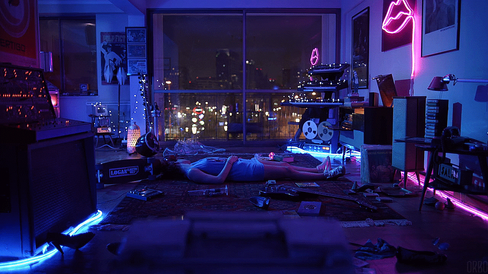

<h2>
Hey there, fellow <𝚍𝚎𝚟𝚜/> 👋🏼. 
 
 

 I am Arjun! 
 </h2>

 

  
 I am a code-blooded web3 degen dev by profession, a decentralization maximalist by ideology 🔥 

  
 Building epic products for over half a decade  

 
 

  <h3>
    
  <h3>
  
    
  <h3>
    
  </h3>

  

 
 

<b> Interested in learning Blockchain from scratch ? </b>  
Check out [What The Fork](https://github.com/ARJUN-R34/what_the_fork).    

Please feel free to clone/fork projects, raise issues and submit PRs if you think something could be better.  
Let's have a conversation <a href="https://github.com/arjun-r34/arjun-r34/issues/new"><b>here</b></a> 
or <a href="mailto:itsarjn@gmail.com"><b>email</b></a> me.

---

<i>Find me on the internet :</i> 

<h4 align="left">Visitors count 👀</h4>

Show some ❤️ by tipping some    
 - 1DKLeznVWHmodfqaQZLoA38AJ2CEBZ6gr6    
 - itsarjn.eth (0x2723a2756ecb99b3b50f239782876fb595728ac0)   

  

## Nice To See You! &nbsp; 
